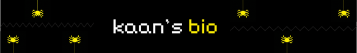

### Hi, I'm Kaan

I'm a software developer who enjoys working on Linux and spending most of my time in the terminal. Rust and compiler internals are my main interests. I love exploring interpreters and low-level concepts in my free time.

### What I Enjoy

- 🦀 **Rust**  My primary language, especially for exploring compiler-related ideas.
- 🐘 **PHP & Laravel**  My daily tech stack for building production applications.

### Tech Stack

